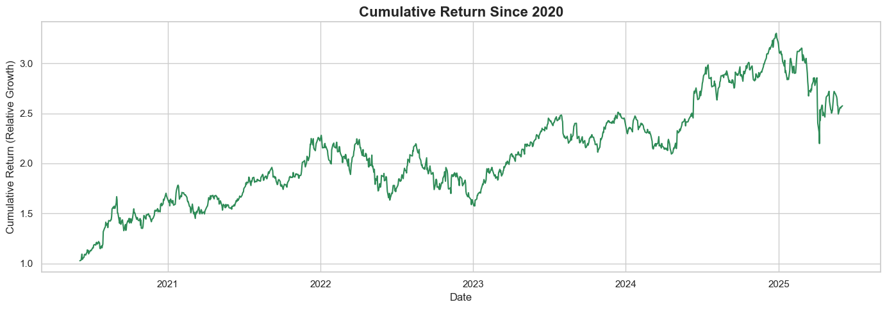

# 📈 Apple Stock EDA (2020–2025)

An exploratory data analysis (EDA) of Apple Inc.'s stock data from 2020 to 2025 — featuring time series trends, feature engineering, return analysis, and visual storytelling.

---

## 📌 What You'll Find in This Project

- ✅ Cleaned and preprocessed Apple stock data from 2020 to 2025
- 📊 Descriptive statistics and distribution analysis
- 📉 Time series visualizations of `Close`, `Open`, `High`, and `Low` prices
- 🔍 Feature engineering:
  - Daily and log returns
  - Moving averages (7-day, 30-day)
  - Rolling volatility
  - Price spread and cumulative return
- 🧠 Year-wise return breakdown and volatility tracking
- 🔥 Correlation heatmap and pairplots
- 🎯 Cumulative investment return simulation
- 📎 Final summary and key takeaways

---

```python
# Hello Everyone,
# Here We're going to perform an EDA on "Apple Stock Dataset From 2020 till 2025"
# You can find it here: https://www.kaggle.com/datasets/hardikchhipa28/apple-stock-dataset-from-2020-till-2025/data

# You'll be finding:

# Overview of Apple’s stock data from 2020 to 2025
# Cleaning and Preprocessing
# Time series visualizations for Close, Open, High, and Low prices
# Distribution analysis using histograms and KDE plots
# Feature engineering to create metrics like daily returns,moving averages, volatility.
# Extraction of date-based features like year, month, and weekday
# A correlation heatmap to understand relationships between numeric variables
```

```python
# Importing Necessary Libarary

import pandas as pd
import seaborn as sns
import numpy as np
import matplotlib.pyplot as plt
import warnings
warnings.filterwarnings('ignore')
```

```python
# Load Dataset
df = pd.read_csv('C:\\Users\\nikrc\\OneDrive\\Desktop\\Datasets\\apple_stocks.csv')

df.head(5)

```

<div>
<style scoped>
    .dataframe tbody tr th:only-of-type {
        vertical-align: middle;
    }

    .dataframe tbody tr th {
        vertical-align: top;
    }

    .dataframe thead th {
        text-align: right;
    }

</style>
<table border="1" class="dataframe">
  <thead>
    <tr style="text-align: right;">
      <th></th>
      <th>Date</th>
      <th>Close</th>
      <th>High</th>
      <th>Low</th>
      <th>Open</th>
      <th>Volume</th>
    </tr>
  </thead>
  <tbody>
    <tr>
      <th>0</th>
      <td>NaN</td>
      <td>AAPL</td>
      <td>AAPL</td>
      <td>AAPL</td>
      <td>AAPL</td>
      <td>AAPL</td>
    </tr>
    <tr>
      <th>1</th>
      <td>2020-06-04</td>
      <td>78.32931518554688</td>
      <td>79.1312690763083</td>
      <td>77.95506657558614</td>
      <td>78.83236263047952</td>
      <td>87560400</td>
    </tr>
    <tr>
      <th>2</th>
      <td>2020-06-05</td>
      <td>80.56021881103516</td>
      <td>80.62097312386399</td>
      <td>78.55046881252456</td>
      <td>78.57962969607472</td>
      <td>137250400</td>
    </tr>
    <tr>
      <th>3</th>
      <td>2020-06-08</td>
      <td>81.03653717041016</td>
      <td>81.07056314819836</td>
      <td>79.54441498185327</td>
      <td>80.25645380649277</td>
      <td>95654400</td>
    </tr>
    <tr>
      <th>4</th>
      <td>2020-06-09</td>
      <td>83.59550476074219</td>
      <td>83.98919153470604</td>
      <td>80.68416273702039</td>
      <td>80.71575616737768</td>
      <td>147712400</td>
    </tr>
  </tbody>
</table>
</div>

```python
# Checking the data types and shape
df.shape
df.info()
```

    <class 'pandas.core.frame.DataFrame'>
    RangeIndex: 1256 entries, 0 to 1255
    Data columns (total 6 columns):
     #   Column  Non-Null Count  Dtype
    ---  ------  --------------  -----
     0   Date    1255 non-null   object
     1   Close   1256 non-null   object
     2   High    1256 non-null   object
     3   Low     1256 non-null   object
     4   Open    1256 non-null   object
     5   Volume  1256 non-null   object
    dtypes: object(6)
    memory usage: 59.0+ KB

```python

```

```python
# As we see above that there are fields that are not in right data type, We need convert them to their appropriate data type

df['Date'] = pd.to_datetime(df['Date'],format = "%Y-%m-%d",errors = "coerce")
cols = ["Close","Open","High","Low","Volume"]
for col in cols:
    df[col] = pd.to_numeric(df[col],errors = "coerce")

# Next we remove any non-numeric data
df = df.dropna()
df["Volume"] = df["Volume"].astype(int).reset_index(drop = True)
df.head()

```

<div>
<style scoped>
    .dataframe tbody tr th:only-of-type {
        vertical-align: middle;
    }

    .dataframe tbody tr th {
        vertical-align: top;
    }

    .dataframe thead th {
        text-align: right;
    }

</style>
<table border="1" class="dataframe">
  <thead>
    <tr style="text-align: right;">
      <th></th>
      <th>Date</th>
      <th>Close</th>
      <th>High</th>
      <th>Low</th>
      <th>Open</th>
      <th>Volume</th>
    </tr>
  </thead>
  <tbody>
    <tr>
      <th>1</th>
      <td>2020-06-04</td>
      <td>78.329315</td>
      <td>79.131269</td>
      <td>77.955067</td>
      <td>78.832363</td>
      <td>137250400.0</td>
    </tr>
    <tr>
      <th>2</th>
      <td>2020-06-05</td>
      <td>80.560219</td>
      <td>80.620973</td>
      <td>78.550469</td>
      <td>78.579630</td>
      <td>95654400.0</td>
    </tr>
    <tr>
      <th>3</th>
      <td>2020-06-08</td>
      <td>81.036537</td>
      <td>81.070563</td>
      <td>79.544415</td>
      <td>80.256454</td>
      <td>147712400.0</td>
    </tr>
    <tr>
      <th>4</th>
      <td>2020-06-09</td>
      <td>83.595505</td>
      <td>83.989192</td>
      <td>80.684163</td>
      <td>80.715756</td>
      <td>166651600.0</td>
    </tr>
    <tr>
      <th>5</th>
      <td>2020-06-10</td>
      <td>85.746208</td>
      <td>86.215230</td>
      <td>84.105842</td>
      <td>84.545702</td>
      <td>201662400.0</td>
    </tr>
  </tbody>
</table>
</div>

```python
# Statistical Data
df.describe().T
```

<div>
<style scoped>
    .dataframe tbody tr th:only-of-type {
        vertical-align: middle;
    }

    .dataframe tbody tr th {
        vertical-align: top;
    }

    .dataframe thead th {
        text-align: right;
    }

</style>
<table border="1" class="dataframe">
  <thead>
    <tr style="text-align: right;">
      <th></th>
      <th>count</th>
      <th>mean</th>
      <th>min</th>
      <th>25%</th>
      <th>50%</th>
      <th>75%</th>
      <th>max</th>
      <th>std</th>
    </tr>
  </thead>
  <tbody>
    <tr>
      <th>Date</th>
      <td>1255</td>
      <td>2022-11-30 12:32:42.071713280</td>
      <td>2020-06-04 00:00:00</td>
      <td>2021-08-31 12:00:00</td>
      <td>2022-11-29 00:00:00</td>
      <td>2024-02-29 12:00:00</td>
      <td>2025-06-02 00:00:00</td>
      <td>NaN</td>
    </tr>
    <tr>
      <th>Close</th>
      <td>1255.0</td>
      <td>164.321062</td>
      <td>78.329315</td>
      <td>136.922234</td>
      <td>162.264175</td>
      <td>188.222137</td>
      <td>258.396667</td>
      <td>38.179689</td>
    </tr>
    <tr>
      <th>High</th>
      <td>1255.0</td>
      <td>166.006163</td>
      <td>79.131269</td>
      <td>139.392588</td>
      <td>163.728834</td>
      <td>189.675969</td>
      <td>259.474086</td>
      <td>38.364282</td>
    </tr>
    <tr>
      <th>Low</th>
      <td>1255.0</td>
      <td>162.443943</td>
      <td>77.955067</td>
      <td>134.935222</td>
      <td>160.141728</td>
      <td>186.846649</td>
      <td>257.010028</td>
      <td>37.891117</td>
    </tr>
    <tr>
      <th>Open</th>
      <td>1255.0</td>
      <td>164.160646</td>
      <td>78.57963</td>
      <td>136.720468</td>
      <td>161.654384</td>
      <td>188.1025</td>
      <td>257.568678</td>
      <td>38.094942</td>
    </tr>
    <tr>
      <th>Volume</th>
      <td>1254.0</td>
      <td>80774969.457735</td>
      <td>23234700.0</td>
      <td>52391125.0</td>
      <td>70451650.0</td>
      <td>95646600.0</td>
      <td>374336800.0</td>
      <td>41929450.207341</td>
    </tr>
  </tbody>
</table>
</div>

```python
# Overall, prices have more than tripled from the minimum to maximum value
```

```python
# Finding if any data is missing
df.isna().mean()*100
```

    Date      0.000000
    Close     0.000000
    High      0.000000
    Low       0.000000
    Open      0.000000
    Volume    0.079681
    dtype: float64

```python
df["Volume"] = df["Volume"].fillna(method = "ffill")
df.isna().mean()*100

```

    Date      0.0
    Close     0.0
    High      0.0
    Low       0.0
    Open      0.0
    Volume    0.0
    dtype: float64

```python
# Cheching for Duplicates
df.duplicated().mean()*100
```

    np.float64(0.0)

```python
# We're done with Cleaning the Dataset, Let's start with EDA
```

```python
# Time Series of Close
cols = ["Close","Open","Low","High"]
for col in cols:
    fig,axes = plt.subplots(1,2,figsize = (20,8),dpi = 120)
    sns.lineplot(x = df["Date"],y = df[col],ax = axes[0],color = '#00b7c7',label = col)
    axes[0].set_xlabel("Date",fontsize = 13,fontweight = "semibold")
    axes[0].set_ylabel(f"{col} Value",fontsize = 13,fontweight = "semibold")
    axes[0].set_title(f"{col[:-1] + 'ing' if col in ['Open', 'Close'] else col} Prices Over Time",fontsize = 18,fontweight = "bold")
    axes[0].legend()
    axes[0].grid(True)

    max_value = df[col].max()
    max_date = df.loc[df[col] == max_value,"Date"].values[0]
    axes[0].scatter(max_date, max_value - 2, color='#0d88e6', s=80, zorder=5, label='Max Close')
    axes[0].annotate(
        f"{max_value: .2f}",
        xy = (max_date,max_value),
        fontsize = 12,
        fontweight ="semibold",
    )


    # Histogram of Closing Price
    sns.histplot(data = df[col],ax = axes[1],kde = True,bins = 30,color='#beb9db')
    axes[1].set_ylabel("Frequency",fontsize = 13,fontweight = "semibold")
    axes[1].set_xlabel(f'{col} Price',fontsize = 13,fontweight = "semibold")
    axes[1].set_title(f"Distribution of {col[:-1] + 'ing' if col in ['Open', 'Close'] else col} Prices",fontsize = 18,fontweight = "bold")
    axes[1].grid(True)

    plt.tight_layout()
    plt.show()
```


```python
# Time Series Trends

# For each of Close, Open, High, Low:
# Line charts show a general uptrend with some fluctuations.
# And I've marked Max values using a scatter marker and label.
# Close peaked at ~$258, High and Low followed similar trends.

# Distributions

# All prices (Open, Close,Low and High) show a somewhat normal distribution but slightly right-skewed, meaning more values cluster on the lower end.
# Volume is heavily right-skewed, suggesting a few days with massive trading spikes.
```

```python
# Correlation Matrix
numeric_df = df.select_dtypes(include = [np.number])
if(numeric_df.shape[1] >= 4):
    corr_matrix = numeric_df.corr()
    sns.heatmap(data = corr_matrix,annot = True,cmap = 'mako',fmt = '.2f',linewidths=0.5,linecolor='black')
    plt.title("Correlation Heatmap")
    plt.grid(True)
    plt.show()
else:
    print('Not enough numeric features for a correlation heatmap.')

# Pairplot for numeric values

sns.set(style="whitegrid", palette="mako")
sns.pairplot(numeric_df)

plt.show()
```


```python
# Correlation Insights

# A correlation heatmap shows:
# Open, Close, High, Low are strongly correlated (r > 0.95).
# Volume shows a weaker correlation with the price-related features — expected, as price doesn't always track with trading volume.

#  Pairplot Insights

# Confirmed linear relationships between price features.
# Showed clear scatter clusters for price comparisons.
# Volume shows spread, not tightly correlated with price metrics.
```

```python
# Feature Engineering

# Daily Return(%)
df['Daily Return(%)'] = df['Close'].pct_change()

# Rolling Means(7 Days and 30 Days)
df['MA_7'] = df['Close'].rolling(window = 7).mean()
df['MA_30'] = df['Close'].rolling(window = 30).mean()

# Rolling Volatility
df['Volatility_7'] = df['Close'].rolling(window = 7).std()
df['Volatility_30'] = df['Close'].rolling(window = 30).std()

# Cumulative Return
df['Cumulative Return'] = (1 + df['Daily Return(%)']).cumprod()

# Date Feature
df['Year'] = df['Date'].dt.year
df['Month'] = df['Date'].dt.month
df['Day'] = df['Date'].dt.day
df["Day Of Week"] = df['Date'].dt.dayofweek
```

```python
df_filtered = df[df['Year'].isin([2021, 2022])]

plt.figure(figsize=(14, 6))
sns.lineplot(x='Date', y='Close', data=df_filtered, label='Close', color='black')
sns.lineplot(x='Date', y='MA_7', data=df_filtered, label='7-Day MA', color='#fd7f6f', alpha=0.7)
sns.lineplot(x='Date', y='MA_30', data=df_filtered, label='30-Day MA', color='#8bd3c7', alpha=0.7)

plt.title("Apple Stock Price with Rolling Averages (2021–2022)", fontsize=16, fontweight="bold")
plt.xlabel("Date")
plt.ylabel("Price")
plt.grid(True)
plt.legend()
plt.tight_layout()
plt.show()

```


```python
# Between 2021 and 2022, Apple stock price moved in sync with short-term trends (7-day MA) and stayed slightly above the long-term trend (30-day MA) — a sign of steady, healthy upward momentum.
# This likely indicates investor confidence, low short-term volatility, and a gradual bullish build-up during that period.
```

```python
# Daily Return Plot

for year in df['Year'].unique():
    df_filtered = df[df['Date'].dt.year == year]
    plt.figure(figsize=(14, 5))
    sns.lineplot(x='Date', y='Daily Return(%)', data=df_filtered, color='purple')
    plt.title(f"Daily Return (%) Over Months in {year}", fontsize=16, fontweight="bold")
    plt.xlabel("Date")
    plt.ylabel("Daily Return")
    plt.grid(True)
    plt.tight_layout()
    plt.show()

```


```python
# In 2020, Apple stock exhibited extreme daily returns, including a 100% spike, likely caused by high market volatility, major events like COVID, and possibly a stock split in August.
# Daily returns smoothed out in later years (2022–2025), signaling more market stability and less speculative movement.
```

```python
plt.figure(figsize=(14, 5))
sns.lineplot(x='Date', y='Cumulative Return', data=df, color='seagreen')
plt.title("Cumulative Return Since 2020", fontsize=16, fontweight="bold")
plt.xlabel("Date")
plt.ylabel("Cumulative Return (Relative Growth)")
plt.grid(True)
plt.tight_layout()
plt.show()

```



```python
# Tripled investment: From 1.0 to ~3.0 at the peak → 200% growth over 5 years.
# Market cycles are clear: growth → correction → rebound.
# The chart reflects Apple’s strength as a long-term investment, despite short-term volatility.
# Highlights why holding long-term pays off, but also shows why timing and diversification matter.
```

```python
# This marks the end of the Exploratory Data Analysis (EDA) for the "Apple Stock Dataset from 2020 to 2025".
# I hope this deep dive helped you understand how Apple's stock has evolved over the years — from trends and volatility to cumulative returns and engineered insights.

# I genuinely hope the analysis was insightful, and that I was able to provide value throughout this exploration.
# Your feedback and suggestions are always welcome — I’d truly appreciate them as I continue learning and improving.

# Thank you! 🙏
```
